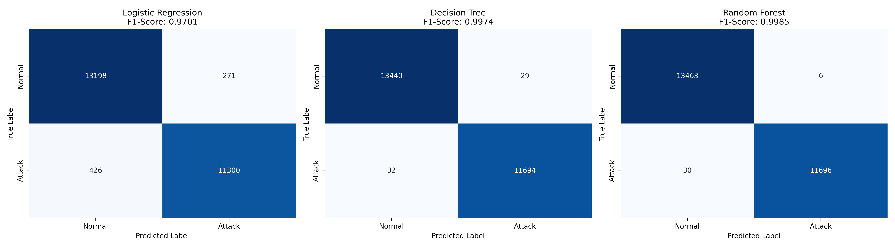
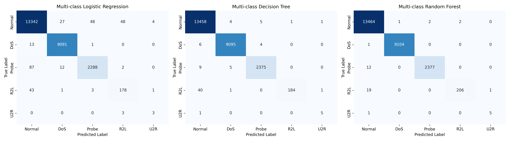

# 🛡️ AI-DRIVEN INTRUSION DETECTION SYSTEM (IDS)
 

**TECH STACK & REQUIREMENTS**
* **Environment:** Python 3.8+ (Anaconda distribution recommended)
* **Libraries:** `scikit-learn`, `pandas`, `numpy`, `matplotlib`, `seaborn`
* **Setup:** Run `pip install -r requirements.txt` to install dependencies.

## PROJECT OVERVIEW
This project applies Supervised Machine Learning algorithms (Logistic Regression, Decision Tree, and Random Forest) to build a robust Network Intrusion Detection System (IDS). By training on the standard **NSL-KDD dataset**, the system analyzes network traffic features to automatically classify connections as benign (`Normal`) or malicious (`DoS`, `Probe`, `R2L`, `U2R`). 

Beyond standard model optimization, this project evaluates the machine learning outputs through a strict **Security Operations Center (SOC)** lens, emphasizing the critical operational trade-offs between False Positives (alert fatigue) and False Negatives (system compromise).

## DATA EXPLORATION & PREPROCESSING

Network traffic data is inherently noisy, highly skewed, and heavily imbalanced. Before training the models, a robust preprocessing pipeline was implemented to handle these real-world data characteristics.

### 1. The Imbalanced Classes Dilemma
Exploratory Data Analysis (EDA) revealed a severe class imbalance characteristic of cybersecurity environments:
* **Majority Classes:** `Normal` traffic (53.46%) and `DoS` attacks (36.46%) dominate the dataset.
* **Minority Threats:** High-severity intrusions like `U2R` (User-to-Root) account for a mere **0.04%** (only 52 samples).
* **Impact:** Without handling this, models naturally bias toward the majority class, creating a false illusion of high accuracy while completely failing to detect rare, critical privilege-escalation attacks.

### 2. Feature Engineering Pipeline
To make the raw network data digestible for Machine Learning algorithms, the following transformations were applied:
* **One-Hot Encoding for Categorical Variables:** Network protocols and statuses (e.g., `protocol_type`, `service`, `flag` with 70 unique values) were transformed into binary vectors. This expands the dataset to 122 features without introducing unintended mathematical hierarchies that could confuse the models.
* **Feature Scaling (StandardScaler):** Network payload features exhibit extreme right-skewed distributions (e.g., `src_bytes` ranges from 0 to over 1.3 billion). Leaving these raw would break Gradient Descent optimization for linear models like Logistic Regression. We applied Standard Scaling ($z = \frac{x - \mu}{\sigma}$) to normalize the variance, ensuring stable and fast convergence.
* **Stratified Splitting:** An 80/20 train-test split was performed using `stratify=y_binary`. This strictly preserves the original class ratios in both sets, guaranteeing that ultra-rare classes like `U2R` are not accidentally wiped out during random sampling.

## MODEL EVALUATION & ALGORITHMIC COMPARISON

The models were evaluated using 5-fold cross-validation and tested on the 20% hold-out set. The performance metrics for binary classification (Normal vs. Attack) are summarized below:

| Model | Accuracy | Precision | Recall | F1-Score |
| :--- | :---: | :---: | :---: | :---: |
| **Logistic Regression** | 0.9723 | 0.9766 | 0.9637 | 0.9701 |
| **Decision Tree** | 0.9976 | 0.9975 | 0.9973 | 0.9974 |
| **Random Forest** | **0.9986** | **0.9995** | **0.9974** | **0.9985** |

 

*(Note: Random Forest shows the darkest main diagonal, indicating massive True Positives/True Negatives with near-zero error cells).*

### 1. Why did Tree-based Models Dominate?
Network traffic data is intrinsically complex and heavily **non-linear**. 
* **Logistic Regression** relies on finding a linear hyperplane (using a Sigmoid function on a weighted sum). It struggles to capture the complex, nested logic of network protocols and payloads without extensive manual feature engineering.
* **Decision Trees** split data using hierarchical, axis-aligned rules ($x_i > threshold$). They naturally map to the "if-else" nature of network routing and packet inspection, seamlessly handling categorical variables and bypassing the need for feature scaling.

### 2. The Ensemble Advantage: Random Forest
While a single Decision Tree achieved high accuracy, it is highly prone to **overfitting** (memorizing training noise by growing too deep). **Random Forest** solves this by leveraging an ensemble mechanism (Bagging). By training multiple diverse decision trees on random subsets of data and aggregating their predictions via majority vote, it drastically reduces variance, ensuring superior stability and generalization (achieving an exceptional F1-Score of **99.85%**).

### 3. Multi-class Challenge: The Minority Trap
When shifting to 5-class classification (Normal, DoS, Probe, R2L, U2R), the Random Forest model maintained perfect F1-Scores (1.00) for majority classes. However, performance dropped for rare attacks:
* **R2L (Remote-to-Local):** 0.95
* **U2R (User-to-Root):** 0.83

*(See the multiclass confusion matrix below illustrating the struggle with R2L and U2R classes)*

**Root Cause:** R2L attacks mimic legitimate user behaviors at the application layer, lacking massive traffic anomalies (like DoS floods). Combined with extreme data sparsity, the model struggles to learn their distinct signatures.

*Future improvements could involve applying SMOTE (Synthetic Minority Over-sampling Technique) or adjusting `class_weight='balanced'` to heavily penalize minority misclassifications.*

## SOC PERSPECTIVE: The FP vs. FN Dilemma (Real-world Deployment)
In a Security Operations Center (SOC), evaluating a Machine Learning model purely on "Accuracy" is a dangerous pitfall. The true operational value of an IDS lies in how it balances **False Positives (FP)** and **False Negatives (FN)**.

Based on the best-performing Random Forest model's confusion matrix:
* **False Negatives (Missed Attacks) = 30 (0.25%):** A real attack slips through undetected because the AI flagged it as `Normal`. This gives threat actors a free pass to compromise the infrastructure, deploy ransomware, or exfiltrate data without triggering any SIEM alerts.
* **False Positives (False Alarms) = 6 (0.04%):** Benign traffic is mistakenly flagged as malicious. While the infrastructure remains perfectly secure, it forces SOC Analysts to waste time investigating ghost threats.

### The Scale of Operations (1 Million Connections/Day)
If this model were deployed in a mid-sized enterprise processing **1,000,000 network connections daily**, it would generate approximately **445 false alarms (FP) per day**. While this requires analyst bandwidth, it is a highly acceptable operational cost. 

**Conclusion:** In cybersecurity production environments, a False Negative can lead to catastrophic system destruction, whereas a False Positive merely drains time. Therefore, optimizing for **Recall** (the ability to catch every single attack, minimizing FN) must always take absolute priority over overall Accuracy or Precision. A highly effective IDS is one where SOC analysts have high confidence that the vast majority of true threats are intercepted.

## Feature Importance & Adversarial Evasion

A critical component of implementing AI in cybersecurity is understanding *how* the model makes its decisions (Explainable AI). By extracting the Feature Importance from the Random Forest model, the top 5 most critical features driving the detection logic are:
1. `src_bytes` & `dst_bytes` (Data payload volume)
2. `flag_SF` (Normal SYN/FIN connection status)
3. `logged_in` (Successful authentication)
4. `dst_host_same_srv_rate` (Frequency of connections to the same service)

**Network Security Context:** This aligns perfectly with human analyst logic. Massive byte transfers indicate DoS attacks or data exfiltration. Failed connection flags (`flag_SF`) and rapid service spikes indicate Probe scans. The `logged_in` status is a direct indicator for tracking privilege escalation (R2L/U2R).

### Adversarial Machine Learning (Evasion Tactics)
If a sophisticated Threat Actor (Red Team) reverse-engineers this model and knows it heavily relies on the features above, they will deploy evasion tactics:
* **Payload Fragmentation:** Splitting malicious payloads into tiny packets to keep `src_bytes` and `dst_bytes` below the anomaly threshold.
* **Protocol Mimicry:** Forcing full TCP 3-way handshakes even during scans to generate normal `flag_SF` statuses.
* **Low & Slow Attacks:** Delaying network scans over long intervals (days/weeks) to artificially lower the `dst_host_same_srv_rate`, blending perfectly into background noise.

## Real-World Limitations & Cross-Dataset Validation (UNSW-NB15)

While the model achieved 99.85% F1-Score on the **NSL-KDD** dataset, a production-grade ML engineer must acknowledge dataset limitations. 
* **The Age of NSL-KDD:** Created in 1999 (updated in 2009), this dataset completely lacks modern threat signatures such as Ransomware, API Exploits, or Advanced Persistent Threats (APTs). The model is essentially blind to contemporary attack vectors.
* **The Reality Check (UNSW-NB15 Evaluation):** To test the model's true robustness, I adapted the script to test it against the modern **UNSW-NB15** dataset. 
  * The Random Forest's F1-Score dropped significantly from **0.9985 (NSL-KDD)** to **0.8845 (UNSW-NB15)**. 
  * *Conclusion:* This proves the existence of **Data Distribution Shift** and high attack sophistication in modern networks. 

## FINAL DEPLOYMENT VERDICT
I would **not** recommend pushing this model directly into Production as a standalone blocking IPS (Intrusion Prevention System). 
Instead, it must be deployed in a **Staging Environment / Shadow Mode** alongside existing rule-based systems (like Snort/Suricata). Mandatory next steps before production include:
1. Testing real-time traffic inference latency.
2. Fine-tuning alert thresholds to further minimize False Positives.
3. Establishing a **Continuous ML Retraining Pipeline** to constantly feed new, modern attack signatures into the model.

## ACKNOWLEDGMENTS & PROJECT CONTEXT

* **Course Context:** This project was originally developed as a comprehensive lab assignment for the **AI for Cybersecurity** course. It bridges the gap between theoretical machine learning concepts and practical network defense operations.
* **Documentation Transparency:** The core implementation, data analysis, and technical insights (which achieved a 10/10 grade) are my original work. However, to ensure this repository meets industry-standard technical writing guidelines, an AI assistant was utilized to help structure, format, and polish this `README.md` document.